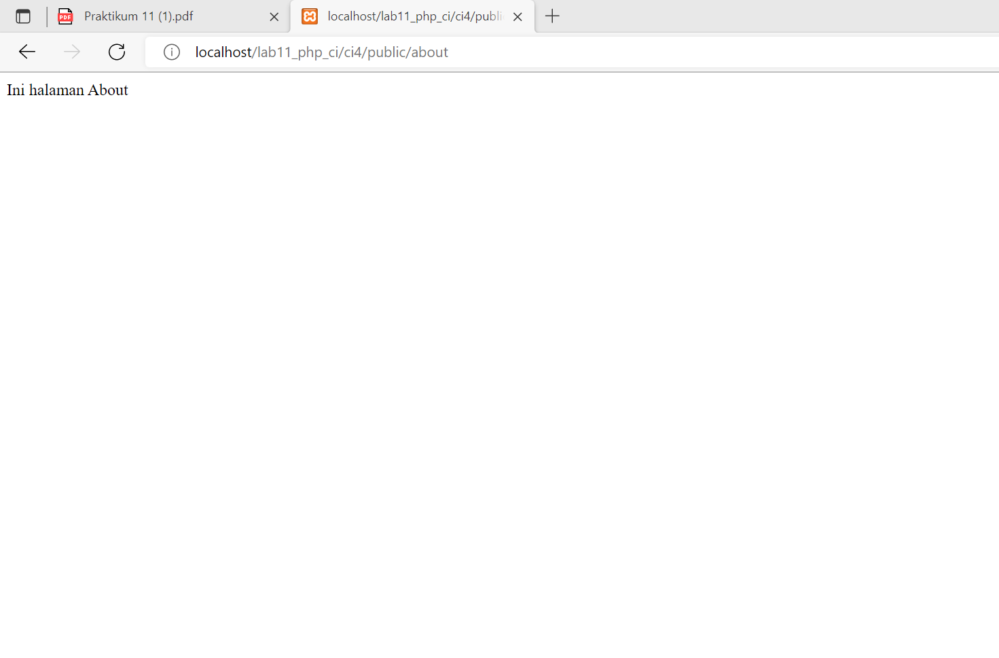

# Lab11Web
# Praktikum 11 PHP Framework 
Langkah-langkah Praktikum
1. Siapkan Vscode
2. Buat folder baru bernama lab11_php_ci di webserver htdocs
3. jalankan xampp, sebelum melakukan start klik apache>config, kemudian pilih PHP (php.ini)

Kemudian, hilangkan (;)pada ekstensi
- php-json
- php-mysqlnd
- php-xml
- php-intl
- libcurl

setelah (;) dihilangkan, langkah selanjutnya adalah klik start pada xampp apache

# Installasi Codeigniter 4
1. unduh Codeigniter dari website https://codeigniter.com/download

2. kemudian download, dan extrak file ke direktori htdocs/lab11_php-ci

3. setelah file di extrak ganti nama file tersebut menjadi ci4

4. kemudian akses localhost/lab11_php_ci/ci4

5. Akses ocalhost/lab11_php_ci/ci4/public/

6. jalankan CLI codeigniter 4 dengan mengakses CLI xampp. Dan ketikan perintah # cd htdocs\lab11_php_ci\ci4 untuk mengarahkan direktori kerja yang di buat

7. ketikan perintah # php spark untuk memanggil CLI Codeigniter

# Mengaktifkan mode Debugging
1. untuk memudahkan developer untuk mengetahui pesan error apabila terjadi kesalahan.
Dengan mengubah nilai konfigurasi pada environment variabel CI_ENVIRONMENT menjadi development

Ubah file env menjadi.env dan buka file ubah nilai variabel nya

2. Langkah selanjutnya adalah mengubah kode file app/controller/Home.php
hilangkan (;) yang ada di belakang message

kemudian refresh kembali browser

3. buka file app/config/Routes.php

tambahkan 3 source code dibawah
4. Kemudian buka CLI xampp kembali, dan ketikan perintah # php spark routes

# Membuat Controller
Buat file baru dengan nama page.php pada direktori Controller, isi dengan script page.php
hasil setelah akses lovalhost/lab11_php_ci/c4/public/about

# Membuat View
Buat file baru di directory app/view/about.php
isi dengan kode yang ada di about.php

# Membuat layout Web dengan CSS
buat file css pada direktory public dengan nama style.css , kemudian copy file dari praktikum 4.

